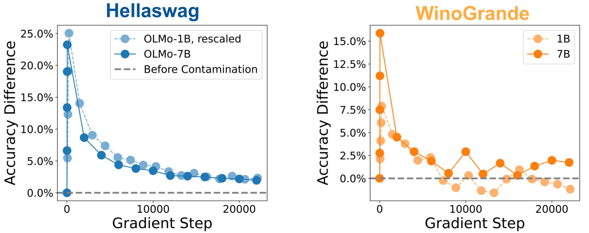

# How much can we forget about Data Contamination? 

<p align="center">
  
</p>

[](https://opensource.org/licenses/MIT)

This is the code repository for the ICML'25 paper ["How much can we forget about Data Contamination?"](https://arxiv.org/abs/2410.03249).     

# Overview

This repository contains the code to reproduce the results in our paper. We also provide the deduplicated benchmark questions, as well as model checkpoints and our training logs for OLMo.

## Using the de-duplicated benchmark questions

Many popular LLM benchmarks contain duplicate questions. For this project, we created a universe of 44000 benchmark questions whose ground-truth answers were deduplicated using fuzzy string matching (for details, see the Section "Filtering Near-Duplicate Benchmark Questions" in our paper). We provide the deduplicated benchmark questions on Huggingface

- https://huggingface.co/datasets/sbordt/forgetting-contamination-hellaswag
- https://huggingface.co/datasets/sbordt/forgetting-contamination-winogrande
- https://huggingface.co/datasets/sbordt/forgetting-contamination-piqa
- https://huggingface.co/datasets/sbordt/forgetting-contamination-boolq
- https://huggingface.co/datasets/sbordt/forgetting-contamination-arc-easy
- https://huggingface.co/datasets/sbordt/forgetting-contamination-mmlu
- https://huggingface.co/datasets/sbordt/forgetting-contamination-social_i_qa

The format of the benchmark questions is the same as in the respective original repositories, with an additional column, "split-id," that can be used to partition the benchmark questions into different subsets. We used the questions with split-id=0 as holdout, and the other splits were contaminated as specified [here](https://github.com/tml-tuebingen/forgetting-contamination/blob/main/llm.c/create_contaminated_dataset.py). 

To work with the deduplicated benchmark questions, you can work with the provided repositories in the same way that you would work with the original repositories (because the format of the questions is the same).

## Reproducing the results in our paper

This repository contains the code that can be used to reproduce the results in our paper.

- ```llm.c/```: The code to contaminate, train, and evaluate small models.
- ```evaluation/```: The code to format benchmark questions, de-duplicate them, and generate the differnt splits that we use for contamination.
- ```olmo/```: The code to download specific training batches, contaminate them, and insert them back into the olmo pre-training data.
- ```compute_results.ipynb```: Compute accuracies, confidence intervals.
- ```figures.ipynb```: Generate the figures in the paper.
- ```forgetting_curves.ipynb```: Generate the forgetting curves.

The OLMo experiments depend on https://github.com/allenai/OLMo. We worked with the repository version with the commit hash ```ca81901eca2faa1947ced49ce5c5cef729203db1```.

## Checkpoints

Model checkpoints are available [here](https://drive.google.com/drive/folders/19fERdR4bmfDmNqkdYass21Jd7ccf9XN3?usp=sharing).

## Weights & Biases Logs

For reproducibility, we additionally share the following Weights & Biases Logs:

OLMo-1B: [Link](https://api.wandb.ai/links/train-on-test/1r02w9og)

OLMO-7B: [Link](https://api.wandb.ai/links/train-on-test/60384zi6)

## Citing our work

If you use the code or the deduplicated benchmark questions in your research, we encourage you to cite our paper. 

```bib
@inproceedings{bordt2025forgetting,
  author    = {Sebastian Bordt, Suraj Srinivas, Valentyn Boreiko, and Ulrike von Luxburg},
  title     = {How much can we forget about Data Contamination?},
  booktitle = {ICML},
  year      = {2025}
 }
```
